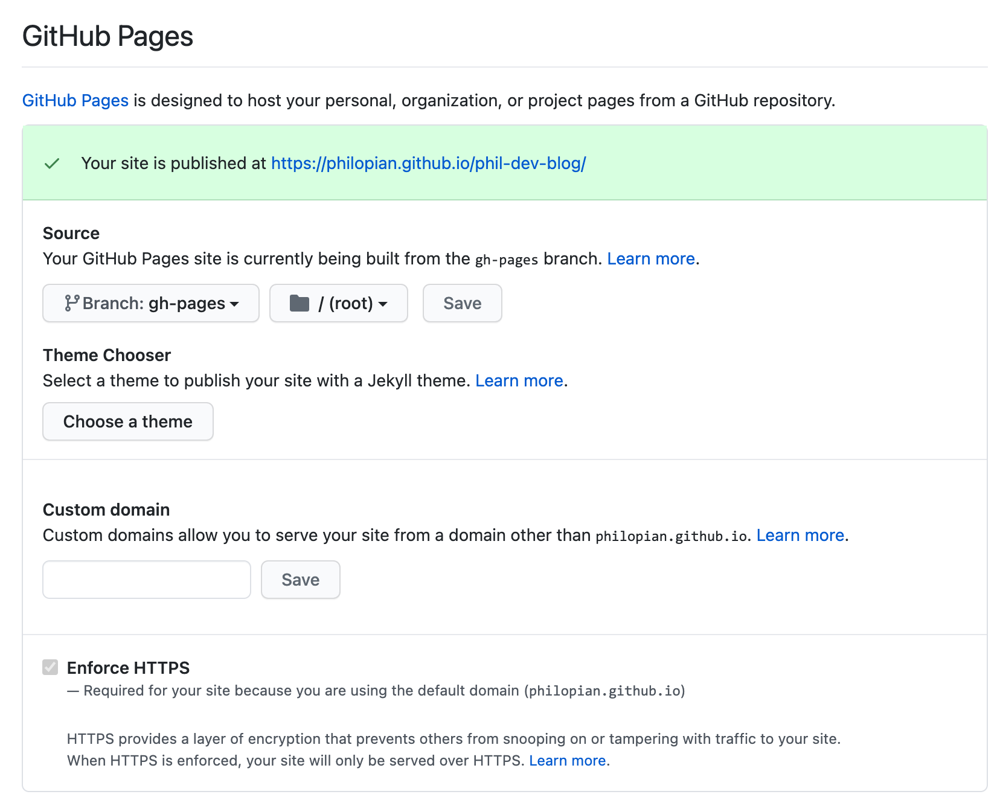

You can build a static site and have it hosted on GitHub Pages with a few configurations to the codebase and the github repository’s settings.

## Setup
1. Install the [gh-pages](https://www.npmjs.com/package/gh-pages) npm package
  ```sh
  $ npm install gh-pages --save-dev
  ```
  - Add a build script to your `package.json`
  - With npm scripts if you prefix the scripts key name with `pre` it will happen before the command and `post` it will happen after
    ```js
    "scripts": {
      "predeploy": "rm -rf ./public",
      "deploy": "npm run build && gh-pages -d public"
    }
    ```
  - When you run npm run deploy all contents of the public folder will be moved to your repository’s gh-pages branch. 
  - Make sure that your repository’s settings has the gh-pages branch set as the source to deploy from.

2. Update Github Pages Settings
  - You must select which branch will be deployed from your repository settings in GitHub for GitHub Pages to function. 
  - Navigate to your repo > Settings > Scroll down to the `GitHub Pages` Section
  

3. Create a new branch called gh-pages
  - The branch name gh-pages is a special branch that github uses to get files to build and publish from.
    ```sh
    $ git branch gh-pages
    ```

## Publishing
- All you need to do to publish to githubpages is to run the npm `deploy` script
  ```sh
  $ npm run deploy
  ```


