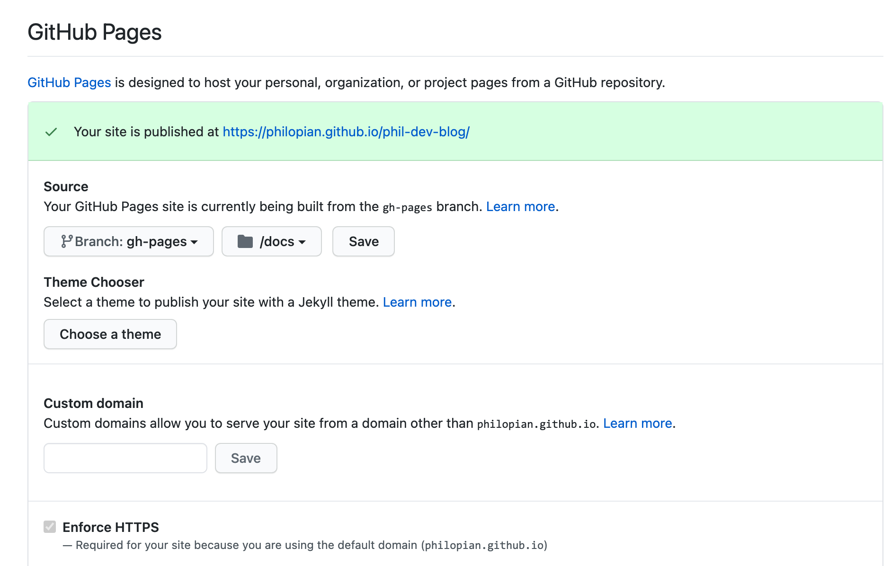

# Github pages
- A Gatsby site can be hosted on GitHub Pages with a few configurations to the codebase and the repository’s settings.


1. Create a new branch called `gh-pages`
  ```sh
  $ git checkout -b gh-pages
  ```

2. Install the npm package
  ```sh
  $ git checkout -b gh-pages
  $ npm install gh-pages --save-dev
  ```
  - add a build script to your `package.json`

    ```js
    "scripts": {
      "deploy:gh": "gatsby build --prefix-paths && gh-pages -d public"
    }
    ```

3. Update Github Settings
- Navigate to your repo > Settings > Scroll down to the `GitHub Pages` Section



4. run the npm `build:gh` script

```sh
$ git checkout -b gh-pages
# make commits
$ git push origin gh-pages
```


5. Update the Gatsby 
  - add a `pathPrefix` to the `gatsby-config.js` file
```js
module.exports = {
  pathPrefix: "/<REPO_NAME>",
}
```


